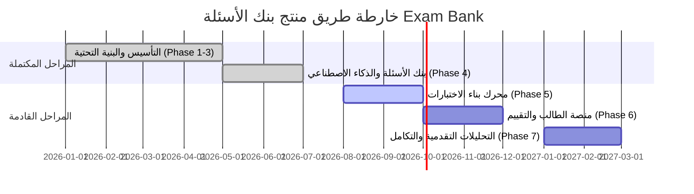

# وثيقة متطلبات المنتج — PRD (Product Requirement Document)
## منصة بنك الأسئلة المتقدم والذكاء الاصطناعي التعليمي | Exam Bank AI Mentor

---

### 📋 معلومات المستند (Document Metadata)

| البند | التفاصيل |
| :--- | :--- |
| **اسم المنتج** | Exam Bank Enterprise (بنك الأسئلة واختبارات المناهج التعليمية) |
| **إصدار الوثيقة** | `v1.1.0-question-bank` |
| **حالة المشروع** | `Active Baseline / Architecture Frozen` (معتمد ومجمد معمارياً) |
| **الجمهور المستهدف** | فرق التطوير، مهندسو البنية التحتية، مدراء المنتجات، المؤسسات التعليمية |
| **تاريخ التحديث** | أغسطس 2026 |

---

## 1. 🎯 الملخص التنفيذي ورؤية المنتج (Executive Summary & Vision)

### 1.1 الرؤية (Vision)
أن تصبح منصة **Exam Bank AI Mentor** المنظومة التعليمية الرقمية المرجعية لإدارة المناهج، وتوليد الأسئلة بالذكاء الاصطناعي، وبناء وتقييم الاختبارات للمؤسسات التعليمية والمدارس وطلاب مرحلة الثانوية العامة. تدمج المنصة بين أحدث تقنيات الذكاء الاصطناعي والمنهجيات التربوية الحديثة لتمكين المعلمين وتسهيل إعداد الاختبارات وتقييم الطلاب بكفاءة وسرعة.

### 1.2 الأهداف الرئيسية (Core Objectives)
- **إدارة المناهج والأسئلة:** تقديم بنك أسئلة شمولى يضمن تصنيف الأسئلة حسب المناهج، المواد، الوحدات، والدروس.
- **توليد الأسئلة الذكي (AI-Powered Generation):** توفير محرك توليد أسئلة آلي مستقل عن مزود الخدمة (Provider-independent) مع إمكانية المراجعة والتعديل قبل التخزين وترشيد التكاليف.
- **تعددية المؤسسات (Multi-Tenancy SaaS):** دعم هيكلية متعددة المستأجرين تضمن عزلاً كاملاً للبيانات بين المدارس والمؤسسات التعليمية.
- **تجربة مستخدم سريعة ودعامة للعمل المباشر:** واجهة SPA مبنية بأحدث تقنيات JavaScript بدون أطر عمل ثقيلة، تدعم اللغة العربية بالكامل (RTL) مع دعم العمل بدون اتصال (PWA Offline Capability).
- **أمان وموثوقية متقدمة:** معمارية مؤسسية تشمل حماية ضد الهجمات، تدوير الرموز (JWT Rotation)، وأنظمة حماية من الفشل (Circuit Breaker).

---

## 2. 👤 الفئات المستهدفة وحالات الاستخدام (Target Personas & User Stories)

### 2.1 الفئات المستهدفة (Personas)
1. **مدير النظام / المؤسسة (Tenant Admin):** إدارة المستخدمين، الأدوار، الصلاحيات، وإعدادات المؤسسة والمحتوى التعليمي.
2. **المعلم / معدّ الأسئلة (Teacher / Item Writer):** إنشاء الأسئلة وتصنيفها، استخدام الذكاء الاصطناعي لتوليد بنوك أسئلة، وإعداد الاختبارات.
3. **الطالب (Student):** أداء الاختبارات عبر المنصة، مراجعة الإجابات، والاطلاع على التحليلات والتقارير الأكاديمية.
4. **مدير المنظومة (Super Admin):** إدارة الاشتراكات، مراقبة استهلاك الذكاء الاصطناعي، متابعة أداء السيرفرات والمؤسسات.

### 2.2 حالات الاستخدام الرئيسية (Key User Stories)
- **بصفتي معلماً،** أريد تصفح الأسئلة حسب المادة والدرس مع تصفية سريعة وسلسة لنوع السؤال ومستوى الصعوبة حتى أختار الأسئلة المناسبة لاختباري.
- **بصفتي معلماً،** أريد توليد مجموعة أسئلة ذكية بناءً على نصوص أو مواضيع محددة باستخدام الذكاء الاصطناعي مع القدرة على تعديلها ومراجعتها قبل الحفظ.
- **بصفتي مسؤؤل مدرسة،** أريد التأكد من عدم الوصول غير المصرح به لأسئلة واختبارات المؤسسة لضمان سرية الامتحانات.
- **بصفتي طالباً،** أريد إجراء الاختبارات بسلاسة وتلقي النتيجة فوراً مع توضيح الإجابات الصحيحة وشرحها.

---

## 3. ⚙️ المتطلبات الوظيفية (Functional Requirements)

### 3.1 النواة الأمنية وتعددية المستأجرين (Multi-Tenancy & Security Module)
- **العزل المؤسسي (Tenant Isolation):** يتم عزل كافة البيانات (الأسئلة، الاختبارات، المستخدمين) باستخدام `tenantId` عبر قاعدة البيانات.
- **التحكم بالوصول المبني على الأدوار (RBAC):** دعم أدوار ومصفوفة صلاحيات ديناميكية (`RolePermission`).
- **إدارة الجلسات والأمان:**
  - استخدام رموز access tokens قصيرة الأجل (في الذاكرة) و refresh tokens (في ملفات الكوكيز المحمية `HTTP-Only Cookie`).
  - آلية كشف إعادة استخدام الرموز (Replay Attack Detection) وحظر الحسابات عند تكرار محاولات الدخول الخاطئة (`failedLoginAttempts`).
  - سجل مراجعة شامل لكافة الأنشطة والحركات الحساسة (`AuditLog`).

### 3.2 هيكلية المناهج والتصنيف (Curriculum Hierarchy Module)
- تنظيم شجري ثلاثي المستويات: **المواد (Subjects) ← الوحدات (Units) ← الدروس (Lessons)**.
- واجهة تصفح شجرية (`HierarchyBrowser`) تدعم التصفح التفاؤلي (Optimistic Navigation) والتحميل المسبق (Prefetching).

### 3.3 بنك الأسئلة ومحرك الذكاء الاصطناعي (Question Bank & AI Engine - Frozen v1.1.0)
- **أنواع الأسئلة المدعومة:** اختيار من متعدد (MCQ)، صواب/خطأ (True/False)، أسئلة مقالية (Essay)، والمطابقة.
- **التصفح والتجميع (Pagination & Filtering):**
  - دعم التصفح القائم على المؤشر (`Cursor-based pagination`) للتعامل مع الملايين من الأسئلة بأعلى كفاءة.
  - محركات تصفية وترتيب متقدمة (`FilterEngine`, `SortEngine`, `SelectionManager`, `CriteriaBuilder`).
  - مزامنة الحالة مع عنوان الرابط (`URL state synchronization & deep linking`).
- **إدارة الأسئلة (CRUD & Draft Autosave):**
  - إنشاء وتعديل واستنساخ الأسئلة.
  - دعم الحفظ التلقائي للمسودات (`Draft autosave`) والتنبيه عند وجود تغيرات غير محفوظة.
  - دعم الحذف المبتكر (`Soft Delete`) واسترجاع المحذوفات أو الحذف النهائي.
- **توليد الأسئلة بالذكاء الاصطناعي (AI Generation):**
  - محرك توليد مستقل عن الموفر (Provider-independent abstraction) يدعم نماذج متعددة.
  - سير عمل غير متزامن (Async queue based workflow via BullMQ).
  - مراجعة وتعديل الأسئلة الموّلدة قبل الاعتماد والحفظ.
  - تتبع دقيق لاستهلاك الذكاء الاصطناعي (مدة الاستجابة، عدد الرموز Tokens، التكلفة، والنموذج المستخدم).

### 3.4 محرك بناء الاختبارات (Exam Builder Module - Phase 5 Planned)
- تجميع الاختبارات من بنك الأسئلة يدوياً أو آلياً بناءً على المعايير والنسب المئوية.
- إعداد نماذج امتحانية متعددة وتنظيم الأرقام والتسلسل.
- تصدير الاختبارات بصيغ PDF جاهزة للطباعة والتوزيع.

### 3.5 واجهة وتجربة الطالب (Student Experience Module - Phase 6 Planned)
- بيئة اختبارات إلكترونية تفاعلية تحتوي على مؤقت زمني وتأمين للاختبار.
- إرسال آلي وتلقائي عند انتهاء الوقت المحدد.
- التصحيح التلقائي للأسئلة الموضوعية وعرض النتائج والتحليلات الفورية.

### 3.6 التحليلات والمراقبة (Analytics & Observability Module)
- تحليلات أداء الأسئلة (معامل الصعوبة، معامل التمييز Item Analysis).
- لوحات قياس لمتابعة استهلاك الموارد، وتصدير مقاييس Prometheus (`prom-client`).

---

## 4. 📐 البنية التقنية والمواصفات الفنية (Technical Specifications)

### 4.1 المكونات الخلفية (Backend Stack)
- **البيئة والمحرك:** Node.js (v20+) مع إطار العمل Express.js (v5.2.1).
- **قاعدة البيانات:** PostgreSQL 15 عبر Prisma ORM (v5.22.0).
- **الذاكرة المؤقتة والمهام:** Redis 7 مع BullMQ (v5.80.5) للمهام غير المتزامنة والمجدول (`node-cron`).
- **التوثيق والتحقق:** Zod (v4.4.3) للتحقق من البيانات، و JWT مع cookie-parser و bcrypt.
- **التسجيل والمراقبة:** Pino + pino-http للتسجيل المكتبي، و prom-client لمقاييس الأداء.

### 4.2 المكونات الأمامية (Frontend Architecture)
- **التقنية الأساسية:** Vanilla JavaScript (ES Modules) بدون أطر عمل ثقيلة لضمان أقصى أداء وسرعة تحميل.
- **التصميم والأسلوب:** CSS مخصص بتصميم عصري (Glassmorphism / Modern Dark & Light modes) يدعم RTL بالكامل مع خطوط Tajawal و Inter.
- **إدارة الحالة والمسارات:**
  - إطار محلي تفاعلي قائم على Proxy (`StateStore`).
  - موجه صفحات أحادي Page SPA Router مع History API.
  - إدارة الطلبات الكاش والتأرجح (`QueryCache`, `RequestManager`, `StateMachine`).
- **تطبيق الويب المتقدم (PWA):** دعم التخزين المحلي باستخدام IndexedDB مع Service Worker لدعم العمل في حالة انقطاع الاتصال.

---

## 5. 🚀 المتطلبات غير الوظيفية (Non-Functional Requirements)

### 5.1 الأداء والسرعة (Performance)
- زمن استجابة API لا يتعدى 200ms للطلبات العادية، و 500ms للاستعلامات المعقدة.
- تحميل الصفحة الأولى للمستخدم (First Contentful Paint) أقل من 1.2 ثانية.
- القدرة على معالجة آلاف استعلامات بنك الأسئلة بفضل `Cursor Pagination` والمؤشرات المجهزة في قاعدة البيانات.

### 5.2 الأمان والحماية (Security)
- الالتزام بمعايير **OWASP Top 10**.
- تشفير كافة البيانات الحساسة وكلمات المرور باستخدام `bcrypt` برتبة salt مناسبة.
- حماية كافة مسارات API عبر `Helmet` لتعديل ترويسات الأمان ورأس HTTP.
- تقييم معدل الطلبات (Rate Limiting) عبر `express-rate-limit` لمنع هجمات التعطيل (DoS/DDoS).

### 5.3 الموثوقية التامة (Reliability & Resilience)
- استخدام نمط قاطع الدائرة (`Circuit Breaker`) وآليات إعادة المحاولة التلقائية (`Retry Policies`) لمنع انهيار المنظومة عند تعطل الخدمات الخارجية (مثل مزودي الذكاء الاصطناعي).

### 5.4 التوافقية والتعدد اللغوي (Accessibility & Localization)
- دعم كامل ومتكامل للغة العربية كأولوية قصوى (RTL Direction) مع إمكانية التبديل بين العربية والإسبانية/الإنجليزية مستقبلاً.
- الالتزام بمعايير الوصول الشامل (WCAG 2.1 Level AA).

---

## 6. 🔒 قواعد تجميد المعمارية (Architectural & Question Bank Freezes)

تطبيقاً للسياسات والتعليمات المعتمدة في مشروع **Exam Bank**، تحكم المبادئ التالية أي أعمال تطوير مستقبلية:

> [!IMPORTANT]
> **تجميد البنية التحتية والمبادي المعمارية (Architecture Freeze v1.0.0):**
> يُحظر تماماً إجراء أي تعديل معماري أو إعادة هيكلة للبنية الأساسية أو سلسلة البرمجيات الوسيطة (Middleware Chains) أو منصات التجريد. يتم التركيز فقط على إصلاح الثغرات وتطوير الميزات الوظيفية.

> [!IMPORTANT]
> **تجميد بنك الأسئلة (Question Bank Freeze v1.1.0):**
> تم اعتماد وتجميد بنية ووظائف بنك الأسئلة (Question Bank) بالكامل. لا يُسمح بإدخال أنماط جديدة أو إعادة هيكلة المكونات، ويكون التطوير مقتصرًا على ميزات الأعمال وإصلاح المشاكل الفنية وتطوير الأداء مع ضمان التوافقية الخلفية التامة.

---

## 7. 🗺️ خارطة طريق المنتج (Product Roadmap)

1. **المرحلة 5: محرك بناء الاختبارات (Exam Builder Engine)** — *قيد التخطيط والتنفيذ*
2. **المرحلة 6: تجربة الطالب والاختبارات الإلكترونية (Student Exam System)**
3. **المرحلة 7: تحليلات الأداء والتقارير الأكاديمية (Advanced Analytics & Reporting)**

---
*تم إنشاء هذا المستند كدليل مرجعي موحد لشروط ومنتجات Exam Bank Enterprise.*
